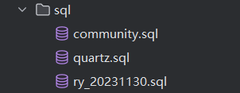

## 简介

基于若依框架实现的社区项目,已经实现了基本的功能。

## 功能

* 用户管理
* 文章管理
* 评论管理
* 文章标签管理
* 通知管理
* 鉴权系统
* 邮箱验证码登录

## API导入

在`src`中有个`DullFan的私有项目`将他导入到ApiPost中就能看大致的API了。  
这里还有一个是WebSocket的API，用来接收用户收到的评论、点赞等通知。

## 使用
将表导入MySQL中  
  
添加MySQL地址  
  
添加Redis地址  

添加邮箱配置  
  
## 联系我

* QQ：2928527233
* CSDN：https://blog.csdn.net/weixin_51298509

